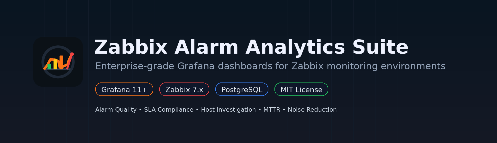
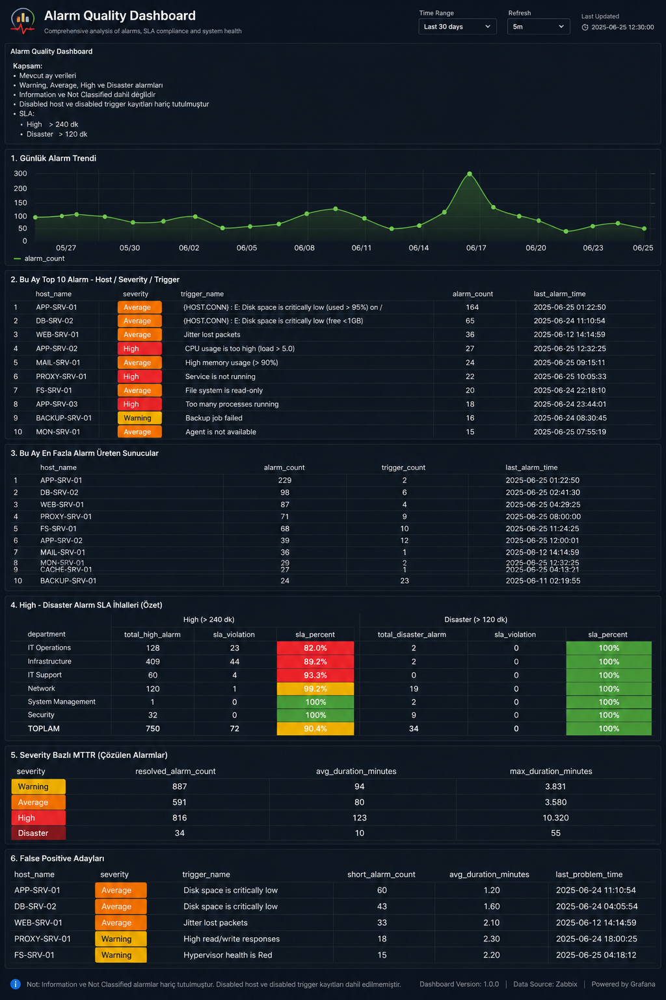
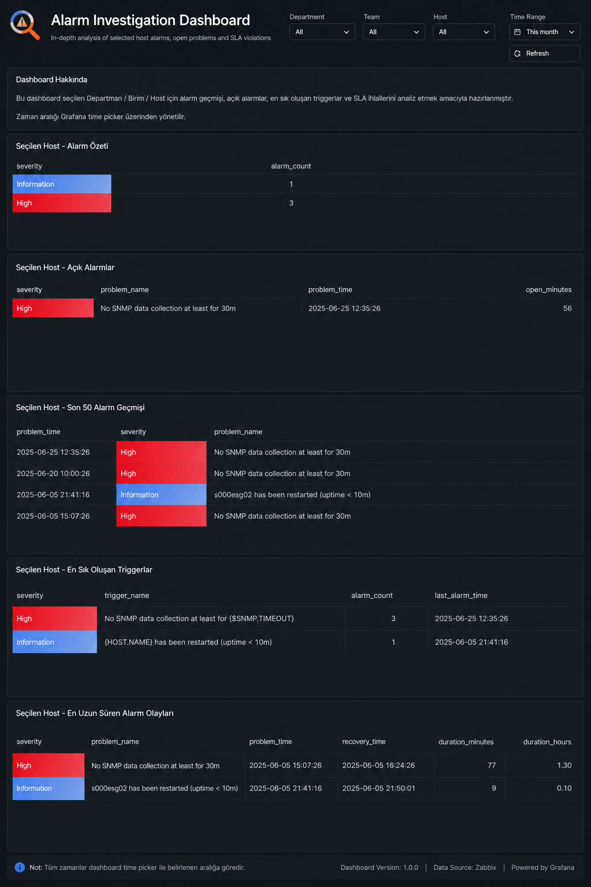

<p align="center">
  
</p>

# Zabbix Alarm Analytics Suite

**Zabbix Alarm Analytics Suite (ZAAS)** provides two open-source Grafana dashboards for Zabbix environments using a PostgreSQL datasource.

The project focuses on **alarm quality**, **SLA compliance**, **MTTR**, **noise reduction**, and **host-level troubleshooting**. It is intended for monitoring, NOC, infrastructure, operations, and observability teams.

<p align="center">
  
  
  
  
</p>

## Dashboards

### 1. Alarm Quality Dashboard

Monthly alarm analytics for Zabbix events:

- Daily alarm trend
- Top alarm sources by host, severity, and trigger
- Top alarm-producing hosts
- Department SLA compliance
- High and Disaster SLA violations
- Team-based alarm distribution
- Severity-based MTTR
- False positive candidates



### 2. Alarm Investigation Dashboard

Host-level troubleshooting workflow with **Department → Team → Host** filtering:

- Selected host alarm summary
- Open problems
- Latest alarm history
- Most frequent triggers
- Longest alarm events
- SLA violation history



## Requirements

| Component | Version |
|---|---|
| Grafana | 11.x or later |
| Zabbix | 7.x or later |
| Database | PostgreSQL |
| Grafana datasource | PostgreSQL datasource connected to the Zabbix database |

Use a **read-only PostgreSQL user** for production dashboards.

## Installation

1. Open Grafana.
2. Go to **Dashboards → New → Import**.
3. Upload a JSON file from the `dashboards/` directory.
4. Select the PostgreSQL datasource connected to your Zabbix database.
5. Import the dashboard.
6. Review the dashboard variables and tag names.

Detailed guide: [`docs/installation.md`](docs/installation.md)

## Dashboard variables

The investigation dashboard uses this variable hierarchy:

```text
Department → Team → Host
```

Default Zabbix host tags expected by the dashboards:

| Purpose | Default tag |
|---|---|
| Department / directorate | `department` |
| Team / business unit | `team` |

If your environment uses different tag names, update the variable queries and SQL filters. See [`docs/variables.md`](docs/variables.md).

## SLA defaults

| Severity | Default SLA threshold |
|---|---:|
| High | 240 minutes |
| Disaster | 120 minutes |

These thresholds can be changed directly in the dashboard SQL queries.

## Repository structure

```text
zabbix-alarm-analytics-suite/
├── assets/
├── catalog/
├── dashboards/
├── docs/
├── screenshots/
├── sql/
├── CHANGELOG.md
├── LICENSE
└── README.md
```

## Notes

- Some analytics panels exclude `Information` and `Not classified` severities to focus on operational alarms.
- Disabled hosts and disabled triggers are excluded in analytics panels.
- The dashboards are SQL-based and do not require Zabbix API access.
- PostgreSQL is currently the supported database backend.

## License

This project is licensed under the MIT License. See [`LICENSE`](LICENSE).

---

If this project helps you improve Zabbix alarm quality, consider giving it a star.
